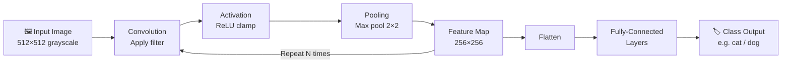
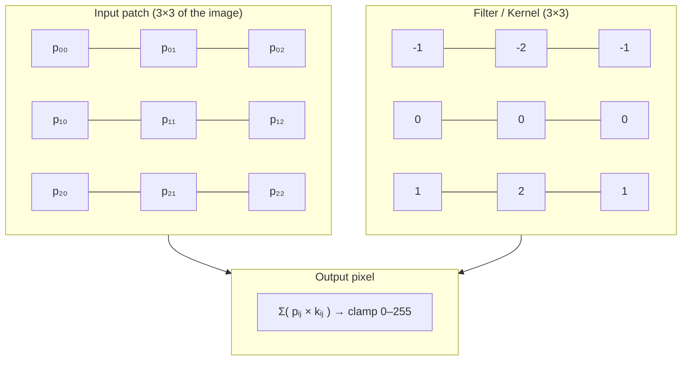
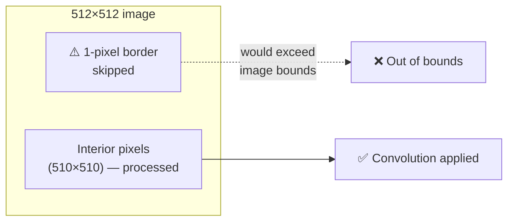
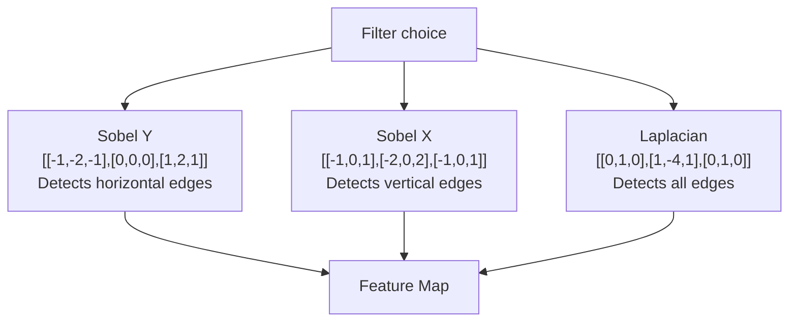
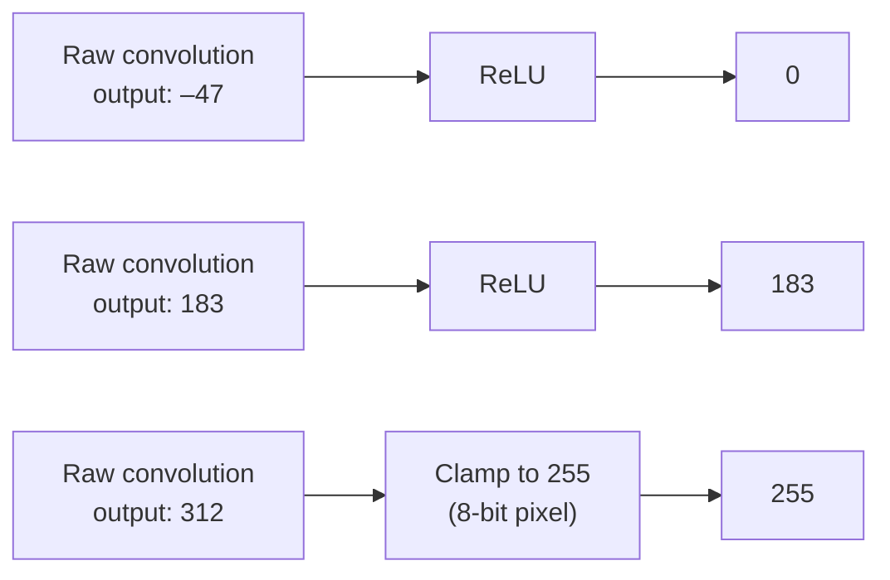
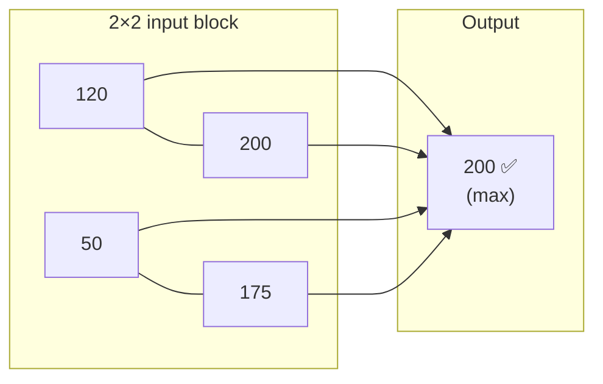
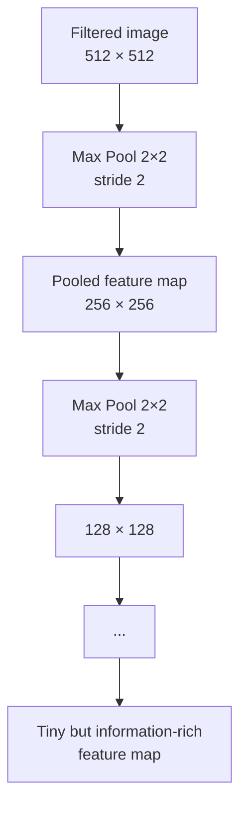

# CNN 101

> A beginner-friendly introduction to Convolutional Neural Networks for CS students — built around hands-on Python code in `CNN-101.ipynb`.

---

## Table of Contents

1. [What is a CNN?](#what-is-a-cnn)
2. [How a CNN processes an image — pipeline overview](#pipeline-overview)
3. [Convolution — the core operation](#convolution)
4. [Filters (Kernels)](#filters-kernels)
5. [Activation (ReLU)](#activation-relu)
6. [Pooling](#pooling)
7. [Full CNN architecture](#full-cnn-architecture)
8. [What this notebook covers](#what-this-notebook-covers)
9. [Running the notebook](#running-the-notebook)
10. [Dependencies](#dependencies)

---

## What is a CNN?

A **Convolutional Neural Network** is a class of deep neural network designed specifically for data that has a **grid-like topology** (images, audio spectrograms, video frames).

Instead of connecting every input pixel to every neuron (which doesn't scale — a 256×256 image has 65 536 inputs!), a CNN exploits two key ideas:

| Idea | Meaning |
|---|---|
| **Local connectivity** | Each neuron only "sees" a small patch of the input |
| **Parameter sharing** | The same filter weights are reused across the entire image |

This makes CNNs enormously more efficient than fully-connected networks for image tasks.

---

## Pipeline Overview



In a real network these stages are stacked many times before the final classifier.

---

## Convolution

### The intuition

Imagine sliding a small magnifying lens over a photograph and at each position asking: *"does this patch look like an edge / a curve / a texture?"*  
That is exactly what a convolution filter does.

### The maths

Given an input image $I$ and a filter $K$ of size $m \times m$, the output feature map $S$ at position $(x, y)$ is:

$$S(x,y) = \sum_{i=0}^{m-1} \sum_{j=0}^{m-1} I(x+i,\; y+j) \cdot K(i,j)$$

### Step-by-step animation (3×3 filter, stride 1)



### Border handling

A 3×3 filter centred on a **border pixel** would reach outside the image.  
The notebook handles this by simply **skipping the 1-pixel border** (iterating from index 1 to `size-1`).



---

## Filters (Kernels)

A filter is just a small matrix of numbers. **Different filters detect different features.**



In a **trained CNN**, the filter values are not hand-crafted — they are **learned via backpropagation** so that early layers detect low-level features (edges, colours) and deeper layers detect high-level concepts (eyes, wheels, faces).

---

## Activation (ReLU)

After the weighted sum, the result is passed through a non-linear **activation function**.  
The simplest and most common is **ReLU** (Rectified Linear Unit):

$$\text{ReLU}(x) = \max(0,\; x)$$



The notebook approximates ReLU by clamping negative values to 0 and values above 255 to 255.

---

## Pooling

### Why pool?

| Without pooling | With max pooling (2×2) |
|---|---|
| Feature map stays large | Spatial size halved each time |
| Lots of redundant information | Retains strongest activations |
| More parameters downstream | Fewer parameters — faster training |
| Sensitive to small shifts | Translation invariant |

### How 2×2 max pooling works



Stride = 2 means the window **does not overlap** — it jumps 2 pixels each step, so the output is exactly half the size in each dimension.



---

## Full CNN Architecture

```mermaid
flowchart LR
    IMG["Input\n512×512"] 
    --> CONV1["Conv Layer 1\nfilters learn edges"]
    --> RELU1["ReLU"]
    --> POOL1["MaxPool 2×2\n→ 256×256"]
    --> CONV2["Conv Layer 2\nfilters learn textures"]
    --> RELU2["ReLU"]
    --> POOL2["MaxPool 2×2\n→ 128×128"]
    --> CONV3["Conv Layer 3\nfilters learn shapes"]
    --> RELU3["ReLU"]
    --> POOL3["MaxPool 2×2\n→ 64×64"]
    --> FLAT["Flatten\n64×64 = 4096 values"]
    --> FC1["Fully-Connected\nLayer"]
    --> FC2["Output Layer\nSoftmax"]
    --> CLS["🏷️ Class\nprobabilities"]
```



> **Key insight:** the notebook manually implements one Conv + Pool cycle. A real CNN (e.g. VGG-16) stacks 13 convolutional layers before the classifier.

---

## What This Notebook Covers

| Notebook cell | Concept demonstrated |
|---|---|
| Import & load image | Input data — `skimage.data.camera()` 512×512 grayscale |
| Display original | Visual baseline |
| Copy + shape | Preparing output buffer; reading `(height, width)` |
| Define filter | Sobel Y kernel + normalisation weight |
| Convolution loop | Manual 3×3 sliding-window convolution with clamping |
| Display filtered | Visualise edge-detected feature map |
| Max pool loop | 2×2 max pooling, stride 2 → 256×256 output |
| Display pooled | Visualise downsampled feature map |

---

## Running the Notebook

```bash
# 1. Clone / download this folder
cd CNN

# 2. Install dependencies
pip install numpy scipy scikit-image opencv-python matplotlib

# 3. Launch Jupyter
jupyter notebook CNN-101.ipynb
```

Or open directly in VS Code with the Jupyter extension.

---

## Dependencies

| Package | Purpose |
|---|---|
| `numpy` | Array maths |
| `scikit-image` | Built-in test images (`data.camera()`) |
| `opencv-python` (`cv2`) | Image I/O utilities |
| `matplotlib` | Plotting |
| `scipy` | (imported; `misc.ascent` removed in v1.10 — replaced by `skimage.data.camera()`) |

---

## Further Reading

- LeCun et al. (1998) — [Gradient-Based Learning Applied to Document Recognition](http://yann.lecun.com/exdb/publis/pdf/lecun-01a.pdf) — the original LeNet paper
- CS231n Stanford — [Convolutional Neural Networks for Visual Recognition](https://cs231n.github.io/)
- 3Blue1Brown — [But what is a neural network?](https://www.youtube.com/watch?v=aircAruvnKk)

