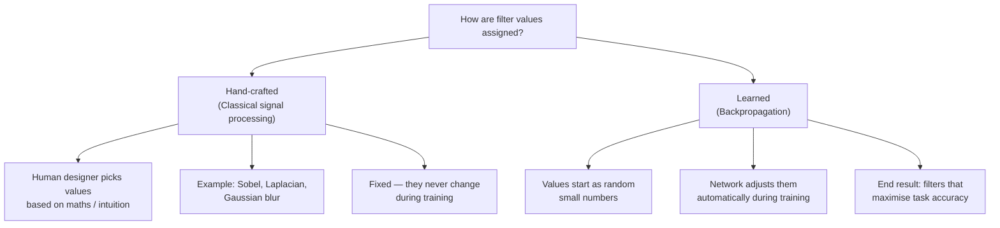
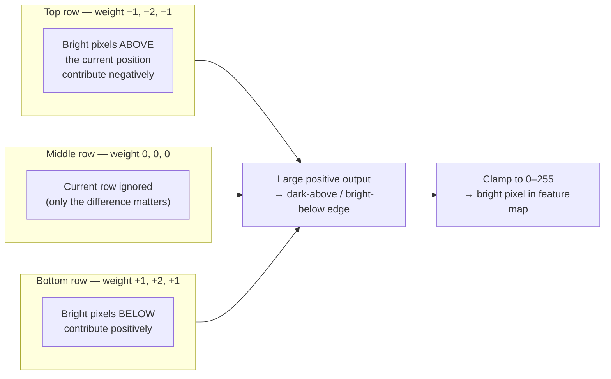
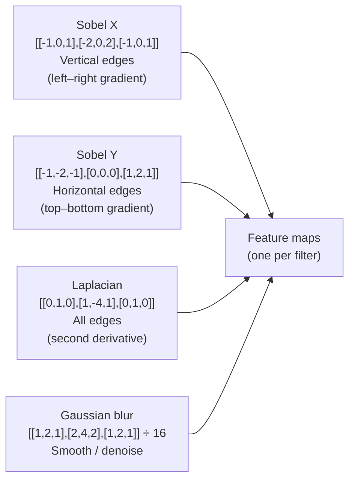
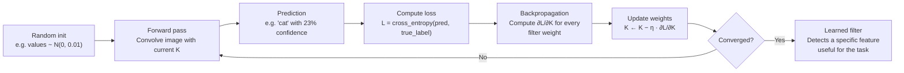
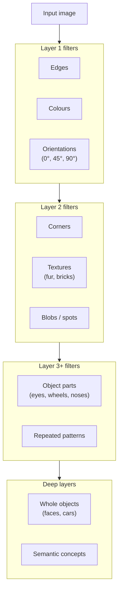
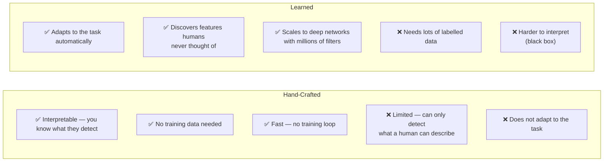

# CNN Filters — How Are the Values Assigned?

> A filter (kernel) is the heart of a convolutional layer.  
> This document explains **where the numbers come from** — both the hand-crafted approach used in `CNN-101.ipynb` and the learned approach used in real neural networks.

---

## Two Ways to Set Filter Values



---

## Approach 1 — Hand-Crafted Filters

The filters in `CNN-101.ipynb` are manually designed using well-known formulas from **image processing**.

### The Sobel Y filter (used in the notebook)

```
[[-1, -2, -1],
 [ 0,  0,  0],
 [ 1,  2,  1]]
```

The values are chosen so the filter computes an **approximation of the vertical image gradient** — the difference in brightness between the row above and the row below each pixel.



The centre column is weighted **double** (−2 / +2) compared to the corners (−1 / +1) so that horizontally adjacent pixels matter more than diagonal ones.

### Other hand-crafted examples



---

## Approach 2 — Learned Filters (Backpropagation)

In a trained CNN (e.g. VGG-16, ResNet), **no human picks the filter values**. They are initialised randomly and gradually improved by backpropagation.

### Training loop



$\eta$ is the **learning rate** — a small number (e.g. 0.001) that controls how big each update step is.

### The update rule in full

$$K_{ij} \;\leftarrow\; K_{ij} \;-\; \eta \;\frac{\partial \mathcal{L}}{\partial K_{ij}}$$

| Symbol | Meaning |
|---|---|
| $K_{ij}$ | One weight in the filter at position $(i, j)$ |
| $\mathcal{L}$ | Loss — how wrong the prediction was |
| $\frac{\partial \mathcal{L}}{\partial K_{ij}}$ | Gradient — which direction to nudge this weight |
| $\eta$ | Learning rate — how big the nudge is |

---

## What Do Learned Filters End Up Detecting?



> **Key insight:** Layer 1 filters in a trained CNN almost always look like **Sobel / Gabor filters** — the same patterns that signal-processing engineers derived by hand decades earlier. Backprop rediscovers them automatically because edges really are the most informative low-level feature in natural images.

---

## Hand-Crafted vs Learned — Summary



---

## How This Notebook Fits In

`CNN-101.ipynb` uses the **hand-crafted** approach to keep the focus on *understanding the mechanism* of convolution — the maths is identical whether the values were hand-designed or learned.

In a real framework (PyTorch / TensorFlow) you would do:

```python
import torch.nn as nn

# Define a conv layer — PyTorch randomly initialises the filter
# and learns the values during model.fit() / training loop
conv = nn.Conv2d(in_channels=1, out_channels=32, kernel_size=3, padding=1)

# After training, inspect what a filter learned:
print(conv.weight[0])   # first filter's 3×3 values
```

The rest — the sliding window, the multiply-and-sum, the feature map — is exactly what the notebook implements by hand.
