Dall-e Lab

https://openai.com/index/dall-e/

https://github.com/openai/openai-cookbook/blob/main/examples/dalle/Image_generations_edits_and_variations_with_DALL-E.ipynb


# OpenAI Image API — Notebook Guide

> `Image_generations_edits_and_variations_with_DALL-E.ipynb`  
> Updated to use **`gpt-image-1-mini`** — the `dall-e-2` / `dall-e-3` models have been deprecated.

---

## Table of Contents

1. [Overview](#overview)
2. [Setup](#setup)
3. [API Endpoint Overview](#api-endpoint-overview)
4. [Generation](#generation)
5. [Variations](#variations)
6. [Edits (Inpainting)](#edits-inpainting)
7. [Response Format — b64_json](#response-format)
8. [Model Comparison](#model-comparison)
9. [Running the Notebook](#running-the-notebook)

---

## Overview

The notebook demonstrates three image operations available through the OpenAI Images API:

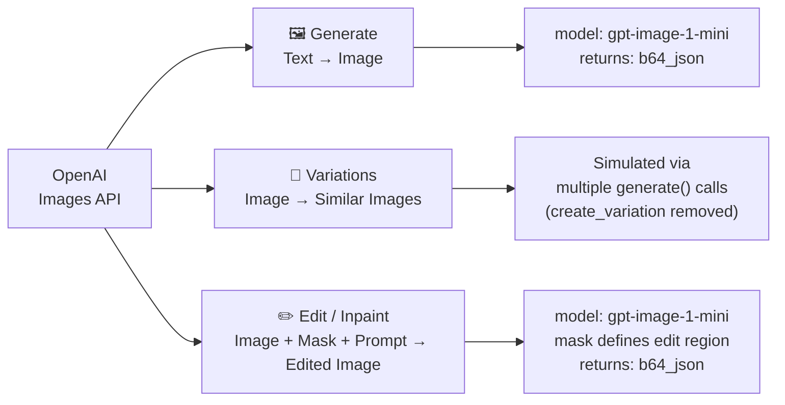

---

## Setup

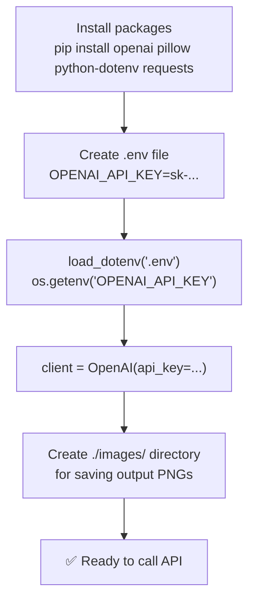

### `.env` file format

```
OPENAI_API_KEY=sk-proj-xxxxxxxxxxxxxxxx
```

---

## API Endpoint Overview

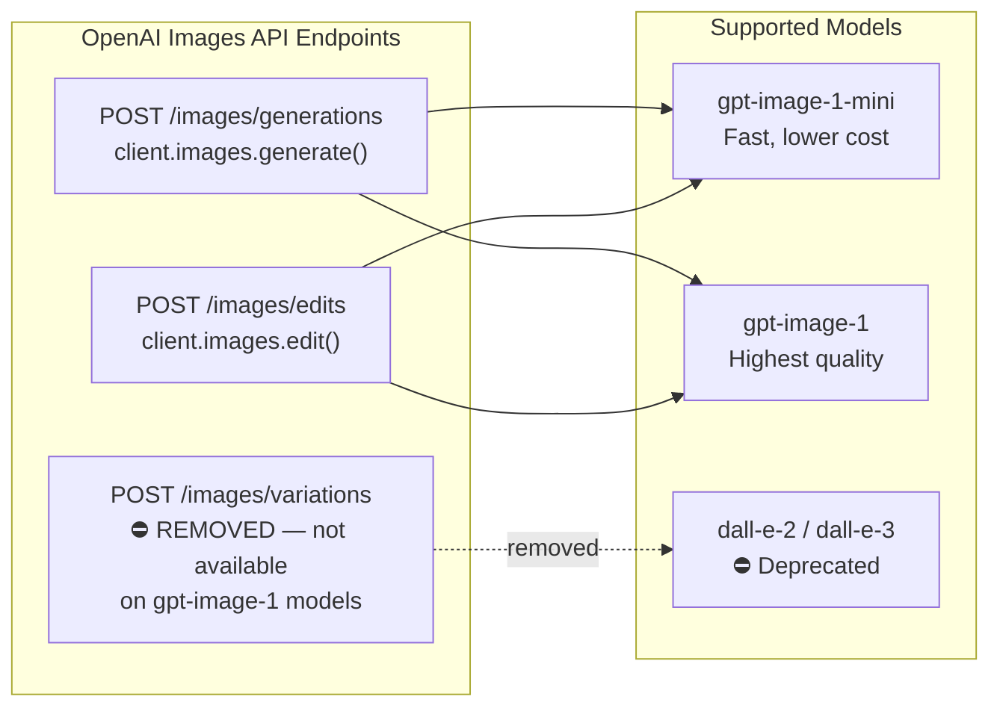

---

## Generation

Text prompt → new image.

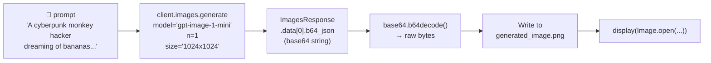

### Key parameters

| Parameter | Value | Notes |
|---|---|---|
| `model` | `gpt-image-1-mini` | Replaces `dall-e-3` |
| `n` | `1` | Only `1` supported by `gpt-image-1-mini` |
| `size` | `1024x1024` | Also: `1536x1024`, `1024x1536`, `auto` |
| `quality` | `auto` | `low` / `medium` / `high` / `auto` |
| `response_format` | *(not set)* | Always returns `b64_json` — URL not supported |

---

## Variations

Generate similar-but-different versions of an image.

> ⚠️ `client.images.create_variation()` has been **removed** from the API.  
> The notebook simulates variations by calling `generate()` multiple times with the same prompt — each call produces a unique interpretation.

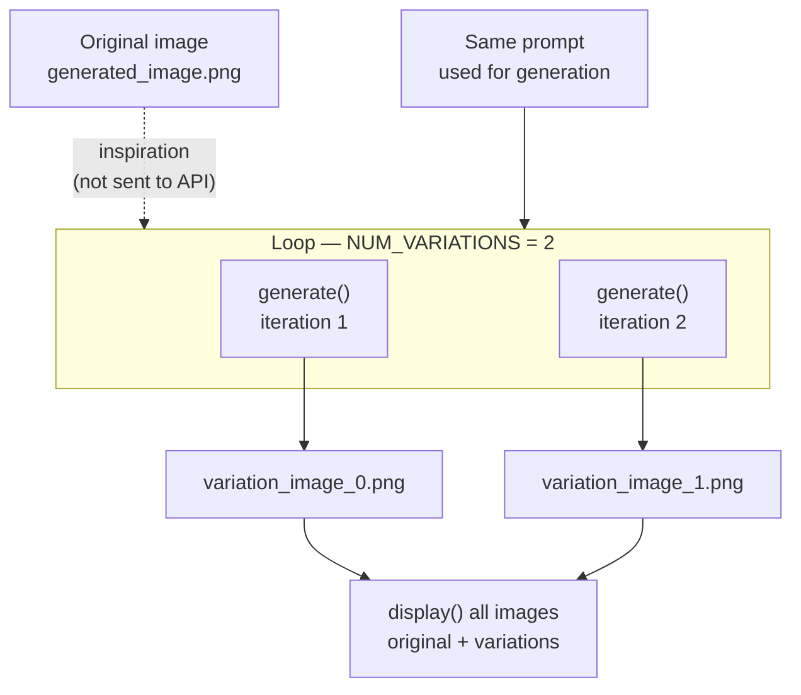

### Retry logic

Each `generate()` call is wrapped in a retry loop with exponential backoff to handle transient network errors:

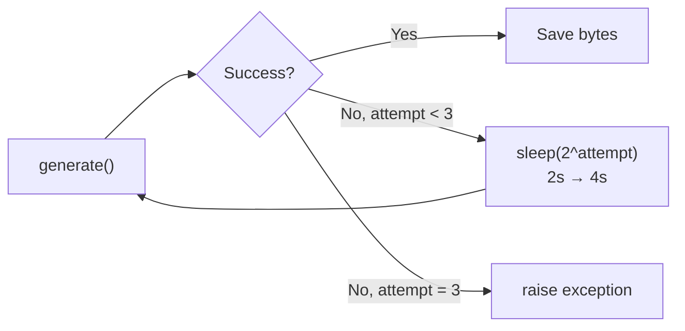

---

## Edits (Inpainting)

Replace a masked region of an image with AI-generated content guided by a prompt.

### Step 1 — Create the mask

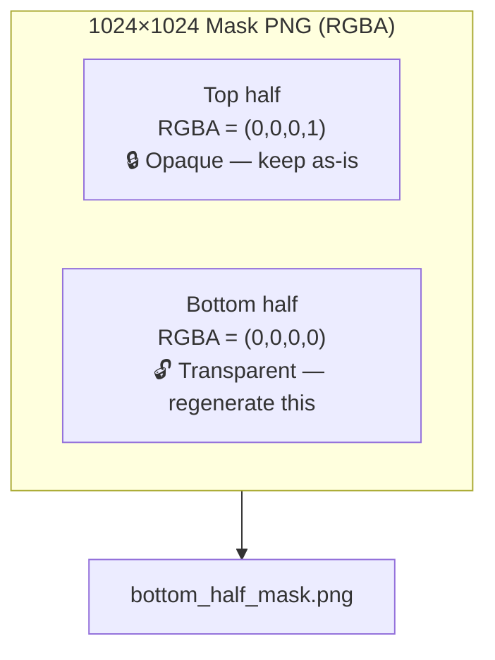

### Step 2 — Call the edit endpoint

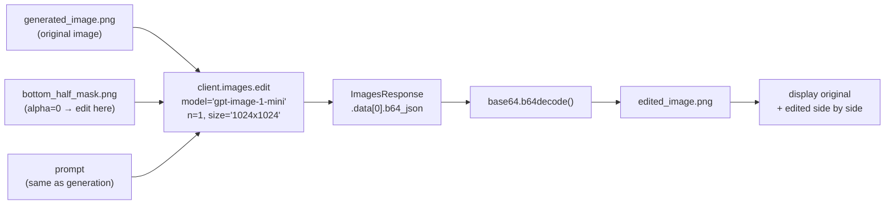

### How the mask works

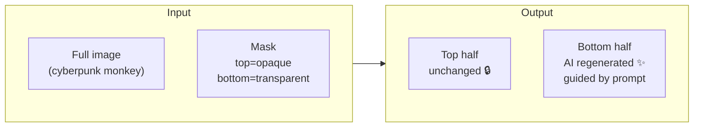

---

## Response Format

`gpt-image-1-mini` **always returns base64-encoded PNG data** — the `response_format="url"` option is not supported.

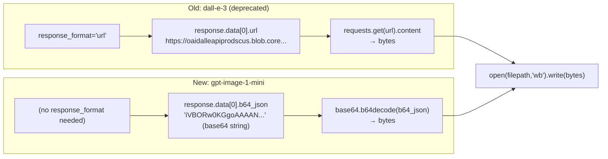

---

## Model Comparison

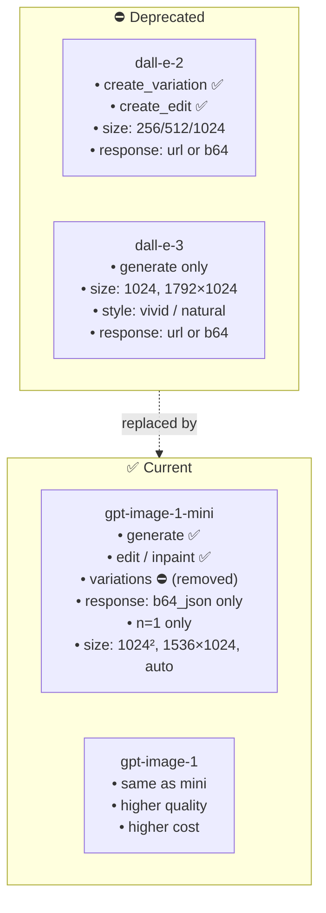

---

## Running the Notebook

```bash
# 1. Install dependencies
pip install openai pillow python-dotenv requests

# 2. Create .env in the same folder as the notebook
echo 'OPENAI_API_KEY=sk-proj-your-key-here' > .env

# 3. Open the notebook
jupyter notebook "Image_generations_edits_and_variations_with_DALL-E.ipynb"
```

### Cell execution order

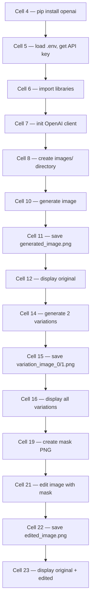
